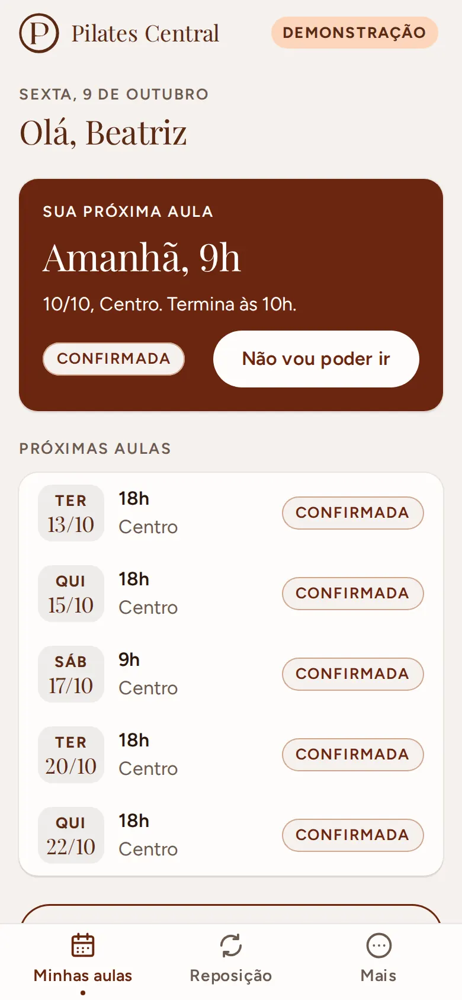
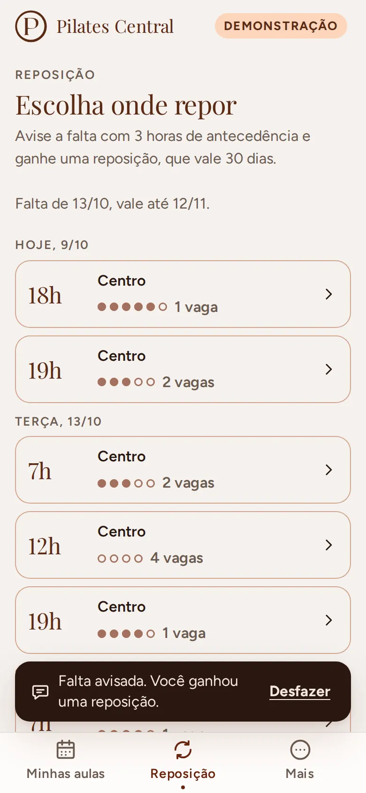
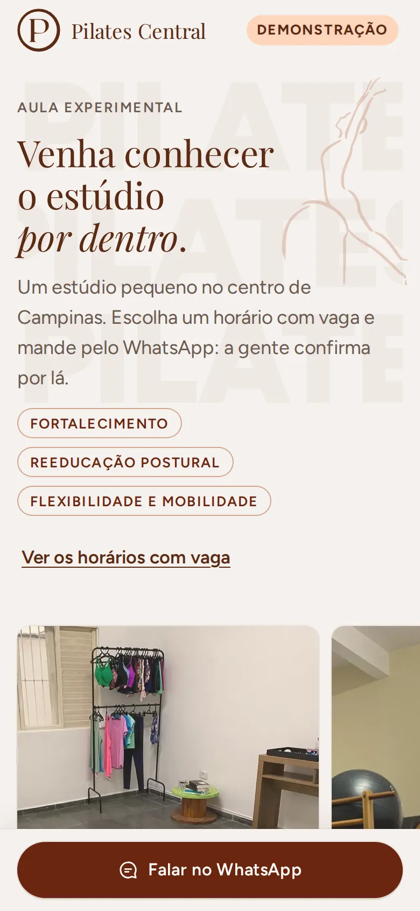
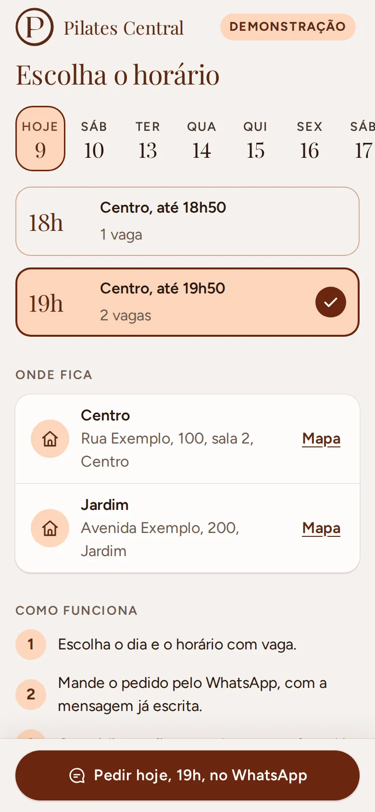
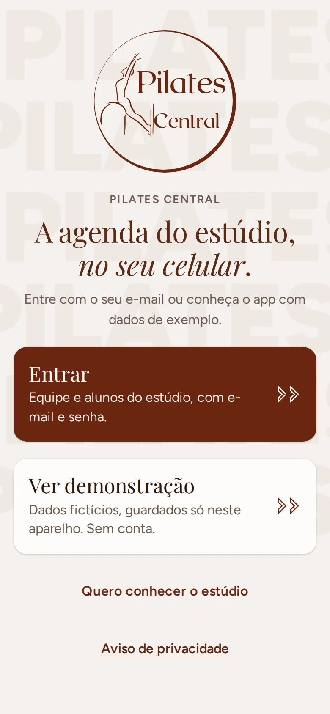
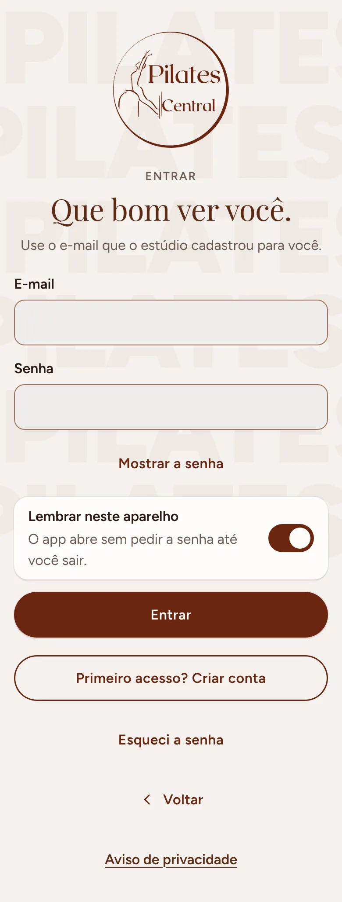
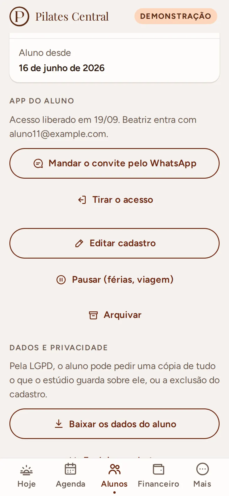

# Pilates Central (web app)

Gestão de um estúdio pequeno de pilates em Campinas: agenda, presença, reposição, alunos, turmas
e financeiro, feito para a administração e os professores usarem no celular, com uma mão, entre
uma aula e outra. O aluno pode avisar que não vem e escolher onde repor, e quem ainda não conhece
o estúdio vê os horários com vaga para uma aula experimental.

- **Demonstração (sem conta, dados fictícios):** https://kohijow.github.io/pilates-central-web/
- **Página de aula experimental:** https://kohijow.github.io/pilates-central-web/experimental/
- **Aviso de privacidade:** https://kohijow.github.io/pilates-central-web/privacidade/

<p>
  
  
  
  
</p>
<p>
  
  
  
  
</p>
<p>
  
  
  
  
</p>
<p>
  
  
  
  
</p>

## O que é

O estúdio não precisa de app de treino: precisa saber quem vem em cada aula, quem faltou, quem
avisou e onde encaixar a reposição, por unidade, e com isso acompanhar o que entra de dinheiro.
Os alunos fazem duas ou três aulas por semana em horários fixos; quando alguém avisa que não vem,
sai daquele dia e é encaixado em outro horário com vaga.

É um **web app instalável** (PWA): abre no Safari do iPhone e no Chrome do Android, vai para a
tela inicial sem loja e funciona sem internet no modo demonstração.

### O que faz

- **Hoje:** próxima aula (ou a que está acontecendo), quantos alunos são esperados, quem avisou
  que não vem e as reposições do dia. Aula que já acabou com alguém sem marcação aparece em
  "Chamada por fazer", a um toque. Em "Para olhar", as reposições perto de vencer e, pelo nome,
  quem anda faltando (o toque abre a ficha, com o WhatsApp). No dia sem aula, diz quando é a próxima.
- **Agenda e chamada:** faixa de dias, unidade, aulas por manhã, tarde e noite, vagas em pontos
  (com o número escrito). Tocar na aula abre a chamada numa folha: presente, faltou ou avisou,
  com "Desfazer"; "Todos presentes" num toque. A chamada abre meia hora antes da aula (antes disso,
  só o aviso de falta, e o card do Hoje diz "Ver quem vem"): ninguém marca de manhã, sem querer,
  a presença da turma da noite. Quem
  avisou no prazo ganha crédito e, ali mesmo, "Encaixar em outro horário" mostra as aulas com vaga.
- **Alunos:** lista com busca (sem acento, ou pelo final do telefone), filtro por unidade e
  situação ("Ativos" é só quem está vindo, o mesmo número do Financeiro; quem está pausado ou
  arquivado tem a sua lista, e a busca sem resultado diz em qual lista achou a pessoa), e um
  destaque discreto para quem faltou várias seguidas. A ficha mostra plano, turmas
  fixas (com aviso quando o plano 2x ou 3x não bate com as turmas), frequência do mês, créditos
  de reposição, mensalidade e pagamentos, e atalhos para WhatsApp e ligação. Cadastro e edição
  com validação em português; pausar (guarda o lugar nas turmas) e arquivar (libera o lugar).
- **Turmas:** grade da semana por unidade, com lugares e frequência do mês. Criar turma, mudar
  horário, lugares e professor, colocar e tirar alunos fixos respeitando a capacidade e o horário
  de cada aluno, encerrar turma (o histórico fica).
- **Reposição:** central com quem tem crédito (o que vence primeiro no topo, com "vence em 3
  dias"), reposições marcadas e créditos vencidos. "Encaixar" mostra só as aulas com vaga da
  unidade nos próximos 14 dias; escolher, confirmar e o aluno aparece na aula de destino como
  reposição. Tudo com "Desfazer".
- **Financeiro** (só a administração): mês por unidade com previsto, recebido, em aberto e alunos
  ativos; quem está em aberto (atrasados primeiro) com lembrete pronto pelo WhatsApp e lançamento
  rápido (valor sugerido pelo plano, forma preferida já marcada; no "Lançar pagamento" geral, a
  escolha do aluno começa por quem ainda não pagou o mês, com o valor); totais por forma de pagamento
  (Pix, cartões, dinheiro, transferência, Gympass, TotalPass, outro); gráfico dos últimos seis
  meses; planilha do mês em CSV.
- **Mais:** perfil, tema, instalar no celular, o link da página de aula experimental (ver,
  compartilhar ou copiar, para pôr no Instagram) e, para a administração, o estúdio (nome,
  WhatsApp, app do aluno e página pública ligados ou não), regras de reposição (antecedência do
  aviso, validade, limite por mês, a partir de quantas ausências seguidas destacar), unidades e equipe.
- **App do aluno** (quando a administração liga e libera o aluno na ficha): as próximas aulas, a
  próxima em destaque; "Não vou poder ir" no prazo gera a reposição e libera o lugar; "Desfazer"
  devolve; a aba Reposição mostra só aulas da unidade dele, com vaga, dentro da validade e do
  prazo; desistir da reposição devolve o crédito. Em cima da hora, o app manda para o WhatsApp.
- **Página de aula experimental** (sem login): o espaço em fotos, os horários com vaga dos
  próximos 14 dias por dia (com a hora em que cada aula termina), um atalho para eles logo na
  capa, o endereço com link para o mapa, "Primeira vez?" (não precisa de experiência, roupa
  confortável, quanto dura a aula) e o pedido pelo WhatsApp do estúdio, sempre à vista, com a
  mensagem pronta ("quero marcar uma aula experimental: sexta, 16 de outubro, às 18h"). Nada é gravado.
- **LGPD:** aviso de privacidade em português simples; na ficha do aluno, baixar os dados dele num
  arquivo e excluir o cadastro (com confirmação).

### Toques por tarefa

Contados num iPhone SE (375 x 667), com uma mão, pelo teste `e2e/toques.spec.ts` nos dois motores.
Digitar na busca e rolar não contam.

| Tarefa | Toques | Caminho |
|---|:-:|---|
| Chamada da turma inteira | 2 (3 com uma falta) | Hoje, **Abrir chamada**, **Todos presentes** (e **Faltou** em quem não veio) |
| Achar um aluno | 3 | **Alunos**, busca, o aluno |
| Lançar pagamento | 3 ou 4 | **Financeiro**, **Lançar** na linha em aberto, **Lançar R$**; ou **Lançar pagamento**, o aluno (quem deve vem primeiro), **Lançar R$** |
| Encaixar reposição | 5 | **Alunos**, **Reposições**, **Encaixar**, a aula, confirmar; ou na chamada: **Avisou**, **Encaixar em outro horário**, a aula, confirmar |
| O aluno remarca a própria aula | 5 | **Não vou poder ir**, **Avisar que não vou**, **reposições para marcar**, a aula, **Confirmar reposição** |
| Visitante pede a aula experimental | 1 a 3 | **Falar no WhatsApp**; ou **Ver os horários com vaga**, o horário, **Pedir no WhatsApp** |

### Quem vê o quê

| | Administração | Professor | Aluno | Visitante |
|---|:-:|:-:|:-:|:-:|
| Agenda e chamada | sim | sim (unidades dele) | só as próprias aulas | horários com vaga |
| Alunos e turmas | vê e edita | vê, sem valores | não | não |
| Financeiro | sim | a aba não existe | não | não |
| Avisar falta, encaixar reposição | de qualquer aluno | dos alunos das unidades dele | a própria, no prazo e com vaga | não |
| Cancelar aula, dar reposição fora do prazo | sim | não | não | não |
| Estúdio, regras, unidades, equipe | sim | só lê as regras | só lê as regras | não |

"Administração" é quem responde pela conta (aparece como **Responsável**) e quem administra junto,
com o mesmo acesso ao dia a dia, financeiro incluído. Só quem é responsável convida, promove ou
tira alguém da administração e passa a conta para outra pessoa. A tabela vale na tela e no banco:
as regras do Firestore negam o que a tela não oferece (ver [docs/seguranca.md](docs/seguranca.md)).

## Como usar a demonstração

1. Abra o link e escolha **Explorar como administração**, **Explorar como professor** ou
   **Explorar como aluno** (ou **Entrar como outra pessoa da equipe** para ver a administração sem
   ser a responsável).
2. Os dados são fictícios (nomes genéricos, e-mails em example.com, telefones 55 11 90000-00xx)
   e ficam guardados só no seu aparelho. Em **Mais > Recomeçar demonstração** tudo volta ao começo.
3. Para ver um dia cheio a qualquer hora, fixe o relógio pela URL:
   `?agora=2026-10-09T10:00` (sexta-feira, 10h em Campinas). `?atraso=1500` simula rede lenta.
   Os dois só existem na demonstração.
4. Bons caminhos: **Alunos > Reposições > Encaixar**; **Financeiro > Lançar** num aluno em aberto;
   **Agenda > 18h > Avisou > Encaixar em outro horário**; **Mais > Equipe > Passar a conta**;
   como aluno, **Não vou poder ir** numa aula e depois **Reposição**; e a
   [página de aula experimental](https://kohijow.github.io/pilates-central-web/experimental/)
   (também pela entrada da demonstração e em **Mais**), que mostra a vaga que o aviso abriu.

Com o projeto Firebase do estúdio configurado, a tela inicial vira duas portas: **Entrar** (o
estúdio de verdade, com e-mail e senha) e **Ver demonstração**. O passo a passo para criar o
projeto, publicar as regras e fazer o primeiro acesso está em [docs/firebase.md](docs/firebase.md).

## Decisões

- **Web app em vez de app de loja.** A administração e muitos alunos usam iPhone; um PWA instala
  pela tela inicial, atualiza sozinho e não precisa de conta de desenvolvedor nem revisão de loja.
- **Preact com sinais.** API quase igual à do React (que o dono do projeto já usa no React
  Native), com uma fração do tamanho; `@preact/signals` deixa o estado reativo sem biblioteca de estado.
- **Regras puras, dados atrás de uma interface.** `src/dominio/` não sabe de onde vêm os dados;
  `src/dados/repositorio.ts` é o contrato, com dois adaptadores: demonstração (localStorage) e
  Firebase. As telas e as regras são as mesmas nos dois.
- **Firebase no plano gratuito, sem Cloud Functions.** Login por e-mail e senha e Firestore com
  regras por papel. O que um servidor faria (conferir papel, prazo, capacidade) fica nas regras
  do banco, testadas no emulador; as gravações que mudam vários documentos se conferem umas às
  outras dentro do mesmo lote.
- **SDK sob demanda e Firestore "lite".** O Firebase só é baixado quando a pessoa escolhe
  **Entrar**, num pedaço separado (fora do pacote inicial e do cache offline). A versão "lite"
  fala REST, sem tempo real nem cache: menor e mais previsível no Safari. A página pública nem usa
  o SDK: lê um documento por REST.
- **Papel por convite, nunca pelo aparelho.** A primeira conta (com o e-mail combinado nas regras)
  reivindica o estúdio; as outras pessoas entram por convite da administração para o e-mail delas,
  que só vale com o e-mail confirmado. O convite vai pelo WhatsApp, com a mensagem pronta (mandar
  e-mail pediria Cloud Functions).
- **Cópias sem nomes para o aluno e o visitante.** O aluno não lê turmas nem registros (têm os
  colegas): lê as vagas de cada aula, o próprio portal e os próprios créditos. A página pública lê
  um documento com horários e vagas. A equipe grava essas cópias junto com cada mudança.
- **Chamada a várias mãos.** A gravação da equipe é uma transação que relê o registro da aula e
  aplica só o que aquela ação mudou, aluno por aluno: duas pessoas na mesma chamada não se
  apagam. A vaga da aula é recalculada com esse registro fresco.
- **A aula é derivada da turma.** Só as exceções são gravadas (presenças, avisos, reposições,
  cancelamento). Quem entra numa turma entra a partir daquele dia (`fixosDesde`): as aulas que já
  passaram não mudam. Detalhes em [docs/modelo-de-dados.md](docs/modelo-de-dados.md).
- **O financeiro mora fora do cadastro do aluno.** Mensalidade, forma preferida e vencimento
  ficam em `FinanceiroDoAluno`: no Firestore uma regra libera ou nega o documento inteiro, então o
  que o professor não pode ler tem que estar em outro documento. O professor nunca pede esses dados.
- **Papéis sem gênero.** "Responsável" e "Administração" em vez de "dona": quem cuida da conta
  pode ser qualquer pessoa da família, e mais de uma pessoa administra. As regras da equipe
  (`src/dominio/equipe.ts`) recebem quem está agindo e recusam as tentativas de escalada, com teste
  para cada uma.
- **Desfazer em vez de confirmar.** Marcar presença, encaixar, tirar da turma ou lançar pagamento
  aplica na hora e oferece "Desfazer", que reverte só o que aquela ação mudou, calculado na hora
  de desfazer. Confirmação só para o que tira gente do lugar (arquivar, encerrar turma, passar a
  conta).
- **Telas empilhadas com "Voltar" escrito.** O app instalado no iPhone não tem o botão de voltar
  do navegador; ficha e formulários abrem por cima da lista (com histórico, então o "voltar" do
  Android também funciona) e a lista volta para onde estava.
- **Escolhas nativas onde ajudam.** Data, hora e listas usam o seletor do próprio celular (a roda
  do iPhone); números pequenos (lugares, duração, dias) têm botões de menos e mais, sem teclado.
- **Uma terracota por tela.** Filtros e escolhas ficaram em pêssego com contorno; o terracota
  sólido é só da ação principal (com filtros e botão principal juntos, três blocos terracota
  disputavam a atenção).

### Movimento

A fluidez no celular é requisito, não enfeite. Regras: só `transform` e `opacity`, durações de
180 a 320 ms, molas em `linear()` com alternativa em `cubic-bezier`, nada que dependa de hover,
`prefers-reduced-motion` respeitado. Os testes de ponta a ponta medem os intervalos entre quadros
durante cada transição e reprovam qualquer animação de outra propriedade.

Medições no Chromium (perfil Pixel 7), p95 dos intervalos entre quadros durante a animação
(60 Hz = 16,7 ms):

| Transição | Normal | CPU 4x mais lenta | Quadro de montar (CPU 4x) |
|---|---|---|---|
| Troca de aba | 16,8 ms | 16,7 a 16,8 ms | 83 a 100 ms |
| Troca de dia pela faixa | 16,7 ms | 16,7 a 16,8 ms | 16,7 ms |
| Troca de dia com o dedo | 16,8 ms | 16,8 ms | 16,7 ms |
| Abrir a folha da aula | 16,8 ms | 16,7 a 16,8 ms | 50 ms |
| Marcar presença e aviso flutuante | 16,8 ms | 16,7 a 16,8 ms | 33 a 50 ms |
| Fechar a folha arrastando | 16,8 ms | 16,8 ms | 16,7 ms |
| Troca de tema (View Transition) | 16,8 ms | 16,7 a 16,8 ms | 17 a 33 ms |
| Abrir a ficha do aluno | 16,7 ms | 16,8 ms | 83 ms |
| Voltar da ficha para a lista | 16,7 ms | 16,7 ms | 83 a 100 ms |
| Troca de seção (Alunos, Turmas, Reposições) | 16,7 ms | 16,8 ms | 50 ms |
| Abrir a folha de encaixe | 16,8 ms | 16,8 ms | 16,7 ms |
| Escolher a aula no encaixe | 16,7 ms | 16,8 ms | 16,7 ms |
| Troca de mês no financeiro (colunas crescem) | 16,7 ms | 16,8 a 33,3 ms | 50 ms |
| Ligar e desligar (interruptor) | 16,7 ms | 16,7 ms | 16,7 ms |
| Aluno: abrir a folha da aula | 16,8 ms | 16,7 a 16,8 ms | 16,7 ms |
| Aluno: avisar a falta e aviso flutuante | 16,8 ms | 16,7 ms | 67 a 83 ms |
| Aluno: troca de aba | 16,8 ms | 16,8 ms | 100 ms |
| Página pública: troca de dia pela faixa | 16,8 ms | 16,7 a 16,8 ms | 17 a 33 ms |
| Página pública: escolher o horário | 16,7 ms | 16,7 a 16,8 ms | 16,7 ms |

Com a CPU 4x mais lenta foram duas rodadas; "quadro de montar" é o quadro em que a tela nova é
montada e pintada, antes de a animação começar. Os vídeos das transições (`GRAVAR=1`) foram
olhados quadro a quadro nos dois motores.

Medido no contêiner do Playwright, num servidor ARM de 4 núcleos dividido com outros processos.
No WebKit desse contêiner não há GPU e tudo é pintado na CPU: até a régua (uma camada sem nada do
app animando só transform e opacity) dá p95 de 50 a 190 ms conforme a carga da máquina. Lá os
tempos ficam registrados no relatório do teste, e o que reprova é animar outra propriedade.

O que as medições mudaram:

- **Sombra sem desfoque nos cards.** No WebKit, a sombra com desfoque de 24 px do briefing levava
  a 2,5 s o quadro de pintar uma tela nova; com a sombra tingida sem desfoque, 250 a 400 ms.
- **A animação começa depois de pintar.** Em aparelho lento, montar a tela nova pode levar mais
  que um quadro; se a animação começasse junto, o movimento "pularia".
- **Troca de aba e de tela em CSS, não em View Transition.** No Chromium a View Transition teve
  picos de 33 ms e bloqueia o toque enquanto roda. Ela ficou só na troca de tema (Chromium); no
  WebKit dos testes a captura da tela travou a página por segundos, então Safari e Firefox trocam
  o tema sem transição até a medição num iPhone de verdade (`?transicao=vista` força).
- **Barras e gráfico por transform.** A barra do recebido e as colunas do gráfico crescem por
  `scaleX`/`scaleY`, nunca por largura ou altura; a marca da seção escolhida (Alunos, Turmas,
  Reposições) desliza como a pílula do dia.
- **Listas longas com "Mostrar todos".** Em aberto, lançamentos e créditos mostram os primeiros e
  um botão para o resto: menos para pintar de uma vez e menos rolagem com uma mão.
- **Interruptor sem cor animada.** Só a bolinha anda (transform); a cor do trilho troca na hora.
- **Página pública reaproveita o movimento do app.** A faixa de dias com a pílula que desliza, a
  marca do horário escolhido e a entrada em cascata são as mesmas peças, medidas do mesmo jeito.
- **Rolagem que não vaza.** Nos vídeos do WebKit, o app do aluno abria com a página ainda rolada
  da tela de entrada (que é comprida); agora cada troca de moldura (entrar, sair) volta ao topo.

## Acessibilidade

Pensada para gente de 40+ usando com uma mão: alvos de toque de 48 px ou mais, texto corrido de
16 px ou mais (conferidos por teste em todas as telas, inclusive as de gestão, as folhas, o app do
aluno, as telas de login e as páginas públicas), contraste de 4,5:1 conferido por teste sobre os
próprios tokens de cor (o âmbar nunca é texto; o terracota médio só aparece em ícone; as cores do
gráfico passam 3:1 sobre o card nos dois temas), estado nunca só por cor (vagas têm número
escrito, presença tem ícone e rótulo, atraso tem palavra, a aula do aluno tem "Confirmada", "Você
avisou" ou "Cancelada"), folha com foco preso e o resto do app inerte, formulário que leva o foco
ao primeiro erro, contador lido como spinbutton, interruptor lido como switch, gráfico com tabela
para leitor de tela, "Mostrar a senha" no login.

## Stack

Vite, TypeScript estrito, Preact, @preact/signals, CSS próprio com variáveis (sem biblioteca de
componentes), Figtree e Playfair Display servidas pelo próprio site (@fontsource), service worker
escrito à mão, Firebase 12 (Auth e Firestore "lite", carregados sob demanda), Vitest,
@firebase/rules-unit-testing e @playwright/test. Emuladores do Firebase (firebase-tools) nos
testes.

## Como rodar

Precisa de Node 22.

```bash
npm ci
npm run dev        # http://127.0.0.1:8887/pilates-central-web/
npm run build      # tipos + empacotamento em dist/
npm run preview    # serve dist/ na mesma porta
```

## Como testar

```bash
npm run typecheck  # app, testes, configurações e service worker
npm run lint
npm test           # Vitest: domínio, dados, molas, gestos, contraste, conversão do Firestore
npm run regras     # regras do Firestore no emulador (precisa de Java 21 e firebase-tools)
npm run e2e        # Playwright: Chromium (Pixel 7) e WebKit (iPhone 13)
```

Os testes de ponta a ponta usam a versão publicada localmente (`npm run build` antes). Em Linux
ARM, onde o WebKit não instala direto, dá para rodar pelo contêiner oficial do Playwright:

```bash
npm run preview &
podman run --rm --network host -v "$PWD":/w:Z -w /w --ipc=host \
  mcr.microsoft.com/playwright:v1.60.0-noble npx playwright test
```

Com os emuladores do Firebase no ar (`firebase emulators:start --only auth,firestore --project
demo-pilates`), `EMULADOR=1` liga também os testes com o SDK de verdade: a responsável entra e vê
o financeiro, o professor entra e não vê, o aluno avisa e remarca, a página pública lista as vagas
sem gravar nada, um professor convidado cria a conta e confirma o e-mail, a administração grava
cadastros, convites, reposição, pagamento e exclusão, login errado e senha nova respondem igual
com ou sem conta, e no primeiro acesso de um estúdio vazio só o e-mail combinado vira responsável. Nenhum teste fala com o
projeto real: uma trava em todos eles corta e reprova qualquer pedido para domínios do Google.

`PORTA=8853` troca a porta (prévia e testes), `LENTO=1` liga a CPU 4x mais lenta no Chromium e
`GRAVAR=1` grava vídeo das transições. No GitHub Actions: tipos, lint, Vitest e build; as regras
no emulador; cada motor num job com os emuladores; e, na `main`, a publicação no Pages.

## Segurança e privacidade

Resumo; o detalhe está em [docs/seguranca.md](docs/seguranca.md).

- Sem servidor próprio: o site é estático (GitHub Pages) e os dados do estúdio ficam no Firestore,
  protegidos por [regras](firestore.rules) com menor privilégio, esquema e tamanho em tudo e o
  resto negado. 174 testes no emulador cobrem cada papel em cada coleção e as tentativas de
  escalada (professor lendo pagamentos, aluno lendo outro aluno, aluno em aula cheia, convite
  forjado, e-mail não confirmado, mexer na posse do estúdio).
- O papel vem de convite para o e-mail confirmado; desativar alguém corta o acesso na hora.
- Login com mensagens que não dizem se o e-mail tem conta; senha nova por e-mail.
- Política de segurança de conteúdo em todas as páginas: scripts, estilos, fontes e imagens só do
  próprio site; conexões só com o próprio site e, com projeto, com o login e o Firestore. Sem
  Google Analytics, sem rastreamento.
- A configuração web do Firebase fica fora do repositório (variáveis do GitHub Actions); na
  demonstração nada sai do aparelho.
- Os dados de exemplo são fictícios: nomes genéricos, e-mails em example.com, telefones
  55 11 90000-00xx. As fotos do espaço no repositório não têm pessoas.
- Observação do aluno é texto livre que só a equipe vê; não há ficha de saúde estruturada.
- A planilha exportada não deixa nome de aluno virar fórmula no Excel (`=`, `+`, `-` e `@` no
  começo ganham um apóstrofo).
- LGPD: [aviso de privacidade](https://kohijow.github.io/pilates-central-web/privacidade/),
  exportação dos dados de um aluno e exclusão com confirmação.

## Estrutura

```
src/
  dominio/       regras puras e testadas (agenda, presença, reposição, frequência, alunos,
                 turmas, pagamentos, equipe, unidades, permissões, cópias para o aluno e a página
                 pública, app do aluno, aula experimental, LGPD)
  dados/         contrato do repositório, demonstração, estado em sinais, ações com desfazer,
                 consultas, exportação, estado do app do aluno
  dados/firebase SDK, login, acesso e convites, adaptador da equipe e do aluno (pedaço sob demanda)
  config/        a configuração do projeto Firebase (lida no build) e dos emuladores
  app/           portas e conta, sessão, navegação, relógio, tema, instalação
  movimento/     molas, tempos, gestos, animação depois de pintar, retorno de toque
  componentes/   botão, campo, seletor, contador, interruptor, chip, card, folha inferior,
                 seções, faixa de dias, vagas, avisos, ícones
  telas/         Entrar, conta (portas, login), Hoje, Agenda e chamada, Alunos, Turmas,
                 Reposição, Financeiro, Mais, app do aluno
  experimental/  página pública de aula experimental
  privacidade/   aviso de privacidade
  estilos/       tokens, base, componentes, telas, gestão, conta, vitrine e movimento
  pwa/           modelo do service worker
firestore.rules  regras do banco (com a trava do primeiro acesso para trocar antes de publicar)
testes-de-regras/ testes das regras no emulador
e2e/             ponta a ponta, acessibilidade, fluidez e os testes com os emuladores
scripts/         plugin do service worker e da política de segurança; geração de ícones
docs/            roteiro, modelo de dados, Firebase, segurança e capturas de tela
```

## Roteiro

Etapa 1: fundação, agenda e presença. Etapa 2: gestão do estúdio (alunos, turmas, reposição,
presença, financeiro, unidades, equipe e configurações). Etapa 3: Firebase com papéis e
convites, regras do Firestore testadas, app do aluno, página de aula experimental e LGPD. Depois,
uma revisão de produto comparou o app, pedido por pedido, com o que o estúdio precisa, e contou
os toques de cada tarefa (a tabela acima). Detalhes
e o que falta (publicar as regras e fazer o primeiro acesso no projeto real) em
[docs/roteiro.md](docs/roteiro.md).

## Créditos

A marca Pilates Central e as fotos do espaço pertencem ao estúdio.
