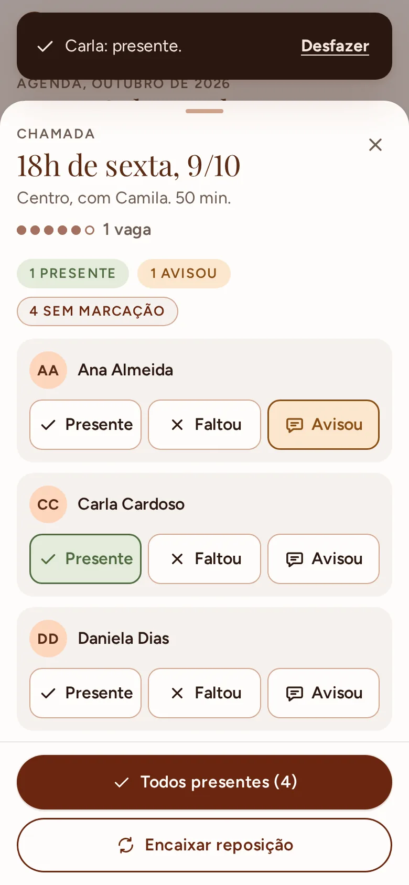
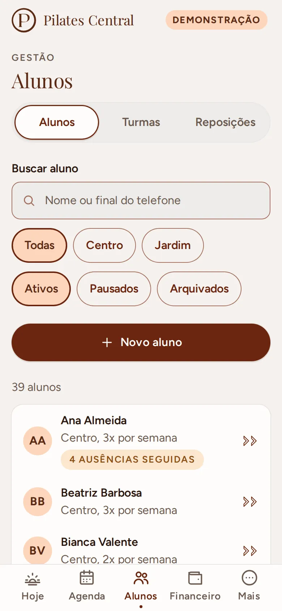
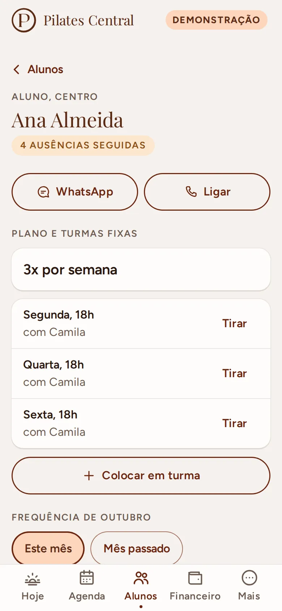
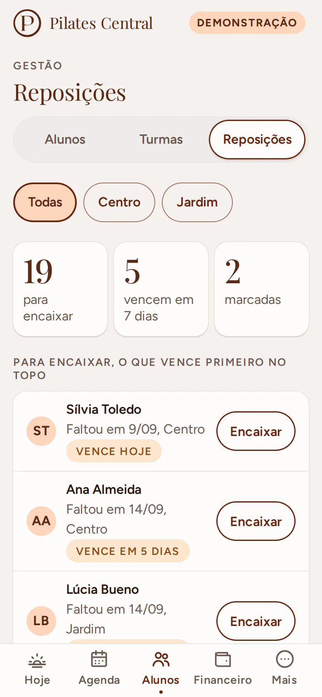
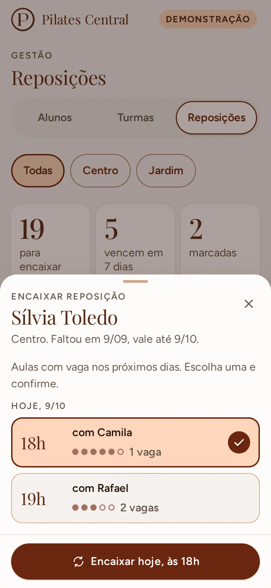
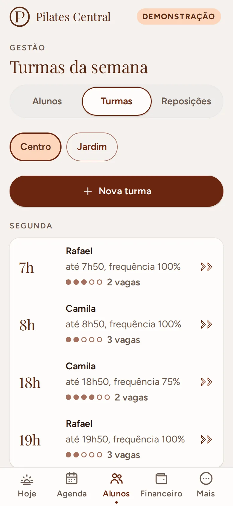
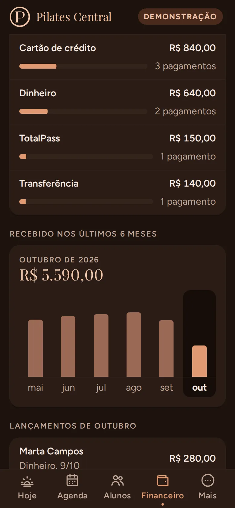
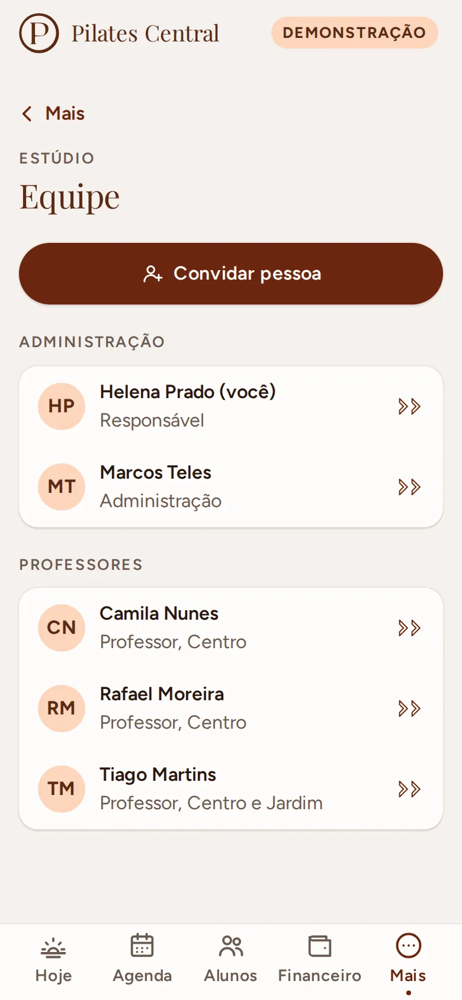

# Pilates Central (web app)

Gestão de um estúdio pequeno de pilates em Campinas: agenda, presença, reposição, alunos, turmas
e financeiro, feito para a administração e os professores usarem no celular, com uma mão, entre
uma aula e outra.

**Demonstração:** https://kohijow.github.io/pilates-central-web/

<p>
  
  
  
  
</p>
<p>
  
  
  
  
</p>
<p>
  
  
  
  
</p>

## O que é

O estúdio não precisa de app de treino: precisa saber quem vem em cada aula, quem faltou, quem
avisou e onde encaixar a reposição, por unidade, e com isso acompanhar o que entra de dinheiro.
Os alunos fazem duas ou três aulas por semana em horários fixos; quando alguém avisa que não vem,
sai daquele dia e é encaixado em outro horário com vaga.

É um **web app instalável** (PWA): abre no Safari do iPhone e no Chrome do Android, vai para a
tela inicial sem loja e funciona sem internet no modo demonstração.

### O que faz

- **Hoje:** próxima aula (ou a que está acontecendo), quantos alunos são esperados, quem avisou
  que não vem e as reposições do dia.
- **Agenda e chamada:** faixa de dias, unidade, aulas por manhã, tarde e noite, vagas em pontos
  (com o número escrito). Tocar na aula abre a chamada numa folha: presente, faltou ou avisou,
  com "Desfazer"; "Todos presentes" num toque. Quem avisou no prazo ganha crédito e, ali mesmo,
  "Encaixar em outro horário" mostra as aulas com vaga.
- **Alunos:** lista com busca (sem acento, ou pelo final do telefone), filtro por unidade e
  situação, e um destaque discreto para quem faltou várias seguidas. A ficha mostra plano, turmas
  fixas (com aviso quando o plano 2x ou 3x não bate com as turmas), frequência do mês, créditos
  de reposição, mensalidade e pagamentos, e atalhos para WhatsApp e ligação. Cadastro e edição
  com validação em português; pausar (guarda o lugar nas turmas) e arquivar (libera o lugar).
- **Turmas:** grade da semana por unidade, com lugares e frequência do mês. Criar turma, mudar
  horário, lugares e professor, colocar e tirar alunos fixos respeitando a capacidade e o horário
  de cada aluno, encerrar turma (o histórico fica).
- **Reposição:** central com quem tem crédito (o que vence primeiro no topo, com "vence em 3
  dias"), reposições marcadas e créditos vencidos. "Encaixar" mostra só as aulas com vaga da
  unidade nos próximos 14 dias; escolher, confirmar e o aluno aparece na aula de destino como
  reposição. Tudo com "Desfazer".
- **Financeiro** (só a administração): mês por unidade com previsto, recebido, em aberto e alunos
  ativos; quem está em aberto (atrasados primeiro) com lembrete pronto pelo WhatsApp e lançamento
  rápido (valor sugerido pelo plano, forma preferida já marcada); totais por forma de pagamento
  (Pix, cartões, dinheiro, transferência, Gympass, TotalPass, outro); gráfico dos últimos seis
  meses; planilha do mês em CSV.
- **Mais:** perfil, tema, instalar no celular e, para a administração, nome e WhatsApp do estúdio,
  regras de reposição (antecedência do aviso, validade, limite por mês, a partir de quantas
  ausências seguidas destacar), unidades e equipe.

### Quem vê o quê

| | Administração | Professor |
|---|:-:|:-:|
| Agenda, chamada, encaixar reposição | sim | sim |
| Alunos e turmas | vê e edita | vê, sem valores |
| Financeiro | sim | a aba não existe |
| Cancelar aula, dar reposição fora do prazo | sim | não |
| Estúdio, regras, unidades, equipe | sim | só lê as regras |

"Administração" é quem responde pela conta (aparece como **Responsável**) e quem administra junto,
com o mesmo acesso ao dia a dia, financeiro incluído. Só quem é responsável convida, promove ou
tira alguém da administração e passa a conta para outra pessoa. Nesta etapa a separação é feita
na interface; no banco ela vira regra do Firestore na etapa 3 (ver [roteiro](docs/roteiro.md)).

## Como usar a demonstração

1. Abra o link e escolha **Explorar como administração** ou **Explorar como professor** (ou
   **Entrar como outra pessoa da equipe** para ver a administração sem ser a responsável).
2. Os dados são fictícios (nomes genéricos, e-mails em example.com, telefones 55 11 90000-00xx)
   e ficam guardados só no seu aparelho. Em **Mais > Recomeçar demonstração** tudo volta ao começo.
3. Para ver um dia cheio a qualquer hora, fixe o relógio pela URL:
   `?agora=2026-10-09T10:00` (sexta-feira, 10h em Campinas). `?atraso=1500` simula rede lenta.
4. Bons caminhos: **Alunos > Reposições > Encaixar**; **Financeiro > Lançar** num aluno em aberto;
   **Agenda > 18h > Avisou > Encaixar em outro horário**; **Mais > Equipe > Passar a conta**.

## Decisões

- **Web app em vez de app de loja.** A administração e muitos alunos usam iPhone; um PWA instala
  pela tela inicial, atualiza sozinho e não precisa de conta de desenvolvedor nem revisão de loja.
- **Preact com sinais.** API quase igual à do React (que o dono do projeto já usa no React
  Native), com uma fração do tamanho; `@preact/signals` deixa o estado reativo sem biblioteca de estado.
- **Regras puras, dados atrás de uma interface.** `src/dominio/` não sabe de onde vêm os dados;
  `src/dados/repositorio.ts` é o contrato e hoje há o adaptador de demonstração (localStorage).
  O do Firebase entra sem mexer em tela nem em regra.
- **A aula é derivada da turma.** Só as exceções são gravadas (presenças, avisos, reposições,
  cancelamento). Quem entra numa turma entra a partir daquele dia (`fixosDesde`): as aulas que já
  passaram não mudam. Detalhes em [docs/modelo-de-dados.md](docs/modelo-de-dados.md).
- **O financeiro mora fora do cadastro do aluno.** Mensalidade, forma preferida e vencimento
  ficam em `FinanceiroDoAluno`: no Firestore uma regra libera ou nega o documento inteiro, então o
  que o professor não pode ler tem que estar em outro documento. O professor nunca pede esses dados.
- **Papéis sem gênero.** "Responsável" e "Administração" em vez de "dona": quem cuida da conta
  pode ser qualquer pessoa da família, e mais de uma pessoa administra. As regras da equipe
  (`src/dominio/equipe.ts`) recebem quem está agindo e recusam as tentativas de escalada, com teste
  para cada uma.
- **Desfazer em vez de confirmar.** Marcar presença, encaixar, tirar da turma ou lançar pagamento
  aplica na hora e oferece "Desfazer", que reverte só o que aquela ação mudou, calculado na hora
  de desfazer. Confirmação só para o que tira gente do lugar (arquivar, encerrar turma, passar a
  conta).
- **Telas empilhadas com "Voltar" escrito.** O app instalado no iPhone não tem o botão de voltar
  do navegador; ficha e formulários abrem por cima da lista (com histórico, então o "voltar" do
  Android também funciona) e a lista volta para onde estava.
- **Escolhas nativas onde ajudam.** Data, hora e listas usam o seletor do próprio celular (a roda
  do iPhone); números pequenos (lugares, duração, dias) têm botões de menos e mais, sem teclado.
- **Uma terracota por tela.** Filtros e escolhas ficaram em pêssego com contorno; o terracota
  sólido é só da ação principal (com filtros e botão principal juntos, três blocos terracota
  disputavam a atenção).

### Movimento

A fluidez no celular é requisito, não enfeite. Regras: só `transform` e `opacity`, durações de
180 a 320 ms, molas em `linear()` com alternativa em `cubic-bezier`, nada que dependa de hover,
`prefers-reduced-motion` respeitado. Os testes de ponta a ponta medem os intervalos entre quadros
durante cada transição e reprovam qualquer animação de outra propriedade.

Medições no Chromium (perfil Pixel 7), p95 dos intervalos entre quadros durante a animação
(60 Hz = 16,7 ms):

| Transição | Normal | CPU 4x mais lenta | Quadro de montar (CPU 4x) |
|---|---|---|---|
| Troca de aba | 16,8 ms | 16,7 a 16,8 ms | 83 a 100 ms |
| Troca de dia pela faixa | 16,7 ms | 16,7 a 16,8 ms | 16,7 ms |
| Troca de dia com o dedo | 16,8 ms | 16,8 ms | 16,7 ms |
| Abrir a folha da aula | 16,8 ms | 16,7 a 16,8 ms | 50 ms |
| Marcar presença e aviso flutuante | 16,8 ms | 16,7 a 16,8 ms | 33 a 50 ms |
| Fechar a folha arrastando | 16,8 ms | 16,8 ms | 16,7 ms |
| Troca de tema (View Transition) | 16,8 ms | 16,7 a 16,8 ms | 17 a 33 ms |
| Abrir a ficha do aluno | 16,7 ms | 16,8 ms | 83 ms |
| Voltar da ficha para a lista | 16,7 ms | 16,7 ms | 83 a 100 ms |
| Troca de seção (Alunos, Turmas, Reposições) | 16,7 ms | 16,8 ms | 50 ms |
| Abrir a folha de encaixe | 16,8 ms | 16,8 ms | 16,7 ms |
| Escolher a aula no encaixe | 16,7 ms | 16,8 ms | 16,7 ms |
| Troca de mês no financeiro (colunas crescem) | 16,7 ms | 16,8 a 33,3 ms | 50 ms |

Com a CPU 4x mais lenta foram duas rodadas; "quadro de montar" é o quadro em que a tela nova é
montada e pintada, antes de a animação começar. Os vídeos das transições (`GRAVAR=1`) foram
olhados quadro a quadro nos dois motores.

Medido no contêiner do Playwright, num servidor ARM de 4 núcleos dividido com outros processos.
No WebKit desse contêiner não há GPU e tudo é pintado na CPU: até a régua (uma camada sem nada do
app animando só transform e opacity) dá p95 de 50 a 190 ms conforme a carga da máquina. Lá os
tempos ficam registrados no relatório do teste, e o que reprova é animar outra propriedade.

O que as medições mudaram (etapas 1 e 2):

- **Sombra sem desfoque nos cards.** No WebKit, a sombra com desfoque de 24 px do briefing levava
  a 2,5 s o quadro de pintar uma tela nova; com a sombra tingida sem desfoque, 250 a 400 ms.
- **A animação começa depois de pintar.** Em aparelho lento, montar a tela nova pode levar mais
  que um quadro; se a animação começasse junto, o movimento "pularia".
- **Troca de aba e de tela em CSS, não em View Transition.** No Chromium a View Transition teve
  picos de 33 ms e bloqueia o toque enquanto roda. Ela ficou só na troca de tema (Chromium); no
  WebKit dos testes a captura da tela travou a página por segundos, então Safari e Firefox trocam
  o tema sem transição até a medição num iPhone de verdade (`?transicao=vista` força).
- **Barras e gráfico por transform.** A barra do recebido e as colunas do gráfico crescem por
  `scaleX`/`scaleY`, nunca por largura ou altura; a marca da seção escolhida (Alunos, Turmas,
  Reposições) desliza como a pílula do dia.
- **Listas longas com "Mostrar todos".** Em aberto, lançamentos e créditos mostram os primeiros e
  um botão para o resto: menos para pintar de uma vez e menos rolagem com uma mão.

## Acessibilidade

Pensada para gente de 40+ usando com uma mão: alvos de toque de 48 px ou mais, texto corrido de
16 px ou mais (conferidos por teste em todas as telas, inclusive as de gestão e as folhas),
contraste de 4,5:1 conferido por teste sobre os próprios tokens de cor (o âmbar nunca é texto; o
terracota médio só aparece em ícone; as cores do gráfico passam 3:1 sobre o card nos dois temas),
estado nunca só por cor (vagas têm número escrito, presença tem ícone e rótulo, atraso tem
palavra), folha com foco preso e o resto do app inerte, formulário que leva o foco ao primeiro
erro, contador de números lido como spinbutton, gráfico com tabela para leitor de tela.

## Stack

Vite, TypeScript estrito, Preact, @preact/signals, CSS próprio com variáveis (sem biblioteca de
componentes), Figtree e Playfair Display servidas pelo próprio site (@fontsource), service worker
escrito à mão, Vitest e @playwright/test. Firebase (Auth e Firestore, plano gratuito) na etapa 3.

## Como rodar

Precisa de Node 22.

```bash
npm ci
npm run dev        # http://127.0.0.1:8887/pilates-central-web/
npm run build      # tipos + empacotamento em dist/
npm run preview    # serve dist/ na mesma porta
```

## Como testar

```bash
npm run typecheck  # app, testes, configurações e service worker
npm run lint
npm test           # Vitest: domínio, dados, molas, gestos e contraste
npm run e2e        # Playwright: Chromium (Pixel 7) e WebKit (iPhone 13)
```

Os testes de ponta a ponta usam a versão publicada localmente (`npm run build` antes). Em Linux
ARM, onde o WebKit não instala direto, dá para rodar pelo contêiner oficial do Playwright:

```bash
npm run preview &
podman run --rm --network host -v "$PWD":/w:Z -w /w --ipc=host \
  mcr.microsoft.com/playwright:v1.60.0-noble npx playwright test
```

`PORTA=8853` troca a porta (prévia e testes), `LENTO=1` liga a CPU 4x mais lenta no Chromium e
`GRAVAR=1` grava vídeo das transições. No GitHub Actions cada motor roda num job e, na `main`, o
site é publicado no Pages.

## Segurança e privacidade

- Sem servidor próprio: o site é estático (GitHub Pages). Na demonstração nada sai do aparelho.
- Política de segurança de conteúdo na página: scripts, estilos, fontes e imagens só do próprio
  site; o único script embutido (o que aplica o tema antes da primeira pintura) entra por hash.
- Os dados de exemplo são fictícios: nomes genéricos, e-mails em example.com, telefones
  55 11 90000-00xx. As fotos do espaço no repositório não têm pessoas.
- Observação do aluno é texto livre que só a equipe vê; não há ficha de saúde estruturada.
- A planilha exportada não deixa nome de aluno virar fórmula no Excel (`=`, `+`, `-` e `@` no
  começo ganham um apóstrofo).
- Na etapa 3, os dados reais ficam no Firestore com regras por papel (professor não lê financeiro,
  administrador não mexe em quem administra), testadas no emulador antes de usar o projeto real.
  Nenhuma chave privada no repositório: a configuração web do Firebase é pública por desenho e a
  proteção são as regras.

## Estrutura

```
src/
  dominio/     regras puras e testadas (agenda, presença, reposição, frequência, alunos, turmas,
               pagamentos, equipe, unidades, permissões)
  dados/       contrato do repositório, adaptador de demonstração, dados fictícios, estado em
               sinais, ações de cadastro com desfazer, consultas de frequência
  movimento/   molas, tempos, gestos, animação depois de pintar, retorno de toque
  componentes/ botão, campo, seletor, contador, chip, card, folha inferior, seções, faixa de dias,
               vagas, avisos, ícones
  telas/       Entrar, Hoje, Agenda e chamada, Alunos (lista, ficha, cadastro), Turmas,
               Reposição, Financeiro, Mais (estúdio, regras, unidades, equipe)
  estilos/     tokens, base, componentes, telas, gestão e movimento
  pwa/         modelo do service worker
e2e/           testes de ponta a ponta, de acessibilidade e de fluidez
scripts/       plugin do service worker e da política de segurança; geração de ícones
docs/          roteiro, modelo de dados e capturas de tela
```

## Roteiro

Etapa 1: fundação, agenda e presença. Etapa 2 (esta): gestão do estúdio (alunos, turmas,
reposição, presença, financeiro, unidades, equipe e configurações). Etapa 3: login e regras do
Firestore, o aluno remarca a própria aula e a página pública de aula experimental. Detalhes e o que
falta em [docs/roteiro.md](docs/roteiro.md).

## Créditos

A marca Pilates Central e as fotos do espaço pertencem ao estúdio.
