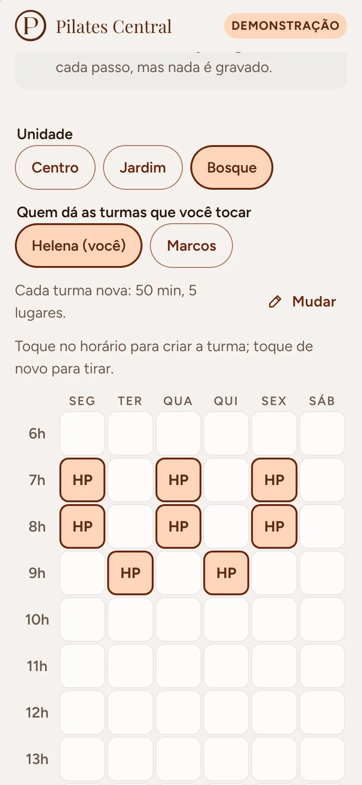
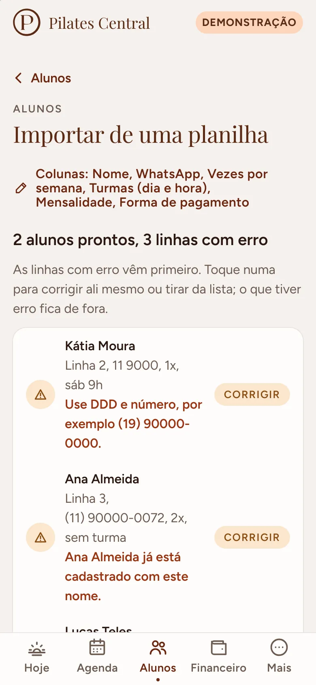
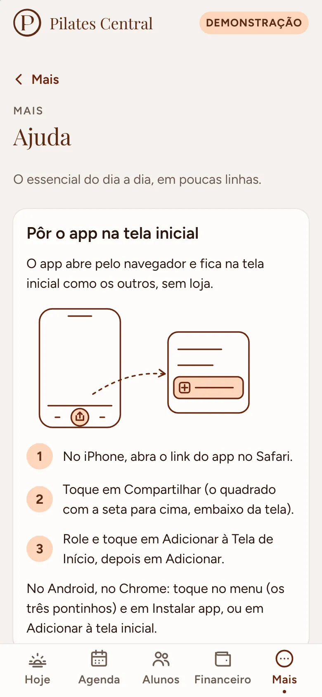

# Pilates Central (web app)

Gestão de um estúdio pequeno de pilates em Campinas: agenda, presença, reposição, alunos, turmas
e financeiro, feito para a administração e os professores usarem no celular, com uma mão, entre
uma aula e outra. O aluno pode avisar que não vem e escolher onde repor, e quem ainda não conhece
o estúdio vê os horários com vaga para uma aula experimental.

- **Demonstração (sem conta, dados fictícios):** https://pilates-central.github.io/
- **Página de aula experimental:** https://pilates-central.github.io/experimental/
- **Aviso de privacidade:** https://pilates-central.github.io/privacidade/

Até o repositório passar para a organização do estúdio, o site vive em
https://kohijow.github.io/pilates-central-web/ (com `experimental/` e `privacidade/` no mesmo
caminho); depois da transferência esse endereço some.

<p>
  
  
  
  
</p>
<p>
  
  
  
  
</p>
<p>
  
  
  
  
</p>
<p>
  
  
  
  
</p>
<p>
  
  
  
</p>

## O que é

O estúdio não precisa de app de treino: precisa saber quem vem em cada aula, quem faltou, quem
avisou e onde encaixar a reposição, por unidade, e com isso acompanhar o que entra de dinheiro.
Os alunos fazem duas ou três aulas por semana em horários fixos; quando alguém avisa que não vem,
sai daquele dia e é encaixado em outro horário com vaga.

É um **web app instalável** (PWA): abre no Safari do iPhone e no Chrome do Android, vai para a
tela inicial sem loja e funciona sem internet no modo demonstração.

### O que faz

- **Hoje:** próxima aula (ou a que está acontecendo), quantos alunos são esperados, quem avisou
  que não vem e as reposições do dia. Aula que já acabou com alguém sem marcação aparece em
  "Chamada por fazer", a um toque. Em "Para olhar", as reposições perto de vencer e, pelo nome,
  quem anda faltando (o toque abre a ficha, com o WhatsApp). No dia sem aula, diz quando é a próxima.
- **Agenda e chamada:** faixa de dias, unidade, aulas por manhã, tarde e noite, vagas em pontos
  (com o número escrito). Tocar na aula abre a chamada numa folha: presente, faltou ou avisou,
  com "Desfazer"; "Todos presentes" num toque. A chamada abre meia hora antes da aula (antes disso,
  só o aviso de falta, e o card do Hoje diz "Ver quem vem"): ninguém marca de manhã, sem querer,
  a presença da turma da noite. Quem
  avisou no prazo ganha crédito e, ali mesmo, "Encaixar em outro horário" mostra as aulas com vaga.
- **Aula experimental na agenda:** quem pediu pelo WhatsApp é registrado pela equipe numa aula
  com vaga, com nome e WhatsApp ("Registrar aula experimental", na chamada ou no Hoje, que lista
  as aulas com vaga dos próximos dias). A pessoa ocupa o lugar, aparece na chamada como
  "experimental" (com o WhatsApp a um toque), recebe presente ou faltou, pode ser tirada enquanto
  a aula não terminou e, se ficar, "Cadastrar como aluno" abre o cadastro já preenchido. A página
  pública e o app do aluno veem só o lugar ocupado; o nome fica com a equipe.
- **Alunos:** lista com busca (sem acento, ou pelo final do telefone), filtro por unidade e
  situação ("Ativos" é só quem está vindo, o mesmo número do Financeiro; quem está pausado ou
  arquivado tem a sua lista, e a busca sem resultado diz em qual lista achou a pessoa), e um
  destaque discreto para quem faltou várias seguidas. A ficha mostra plano, turmas
  fixas (com aviso quando o plano 2x ou 3x não bate com as turmas), frequência do mês, créditos
  de reposição, mensalidade e pagamentos, e atalhos para WhatsApp e ligação. Cadastro e edição
  com validação em português; pausar (guarda o lugar nas turmas) e arquivar (libera o lugar).
- **Turmas:** grade da semana por unidade, com lugares e frequência do mês. Criar turma, mudar
  horário, lugares e professor, colocar e tirar alunos fixos respeitando a capacidade e o horário
  de cada aluno, encerrar turma (o histórico fica).
- **Reposição:** central com quem tem crédito (o que vence primeiro no topo, com "vence em 3
  dias"), reposições marcadas e créditos vencidos. "Encaixar" mostra só as aulas com vaga da
  unidade nos próximos 14 dias; escolher, confirmar e o aluno aparece na aula de destino como
  reposição. Tudo com "Desfazer".
- **Financeiro** (só a administração): mês por unidade com previsto, recebido, em aberto e alunos
  ativos; quem está em aberto (atrasados primeiro) com lembrete pronto pelo WhatsApp e lançamento
  rápido (valor sugerido pelo plano, forma preferida já marcada; no "Lançar pagamento" geral, a
  escolha do aluno começa por quem ainda não pagou o mês, com o valor); totais por forma de pagamento
  (Pix, cartões, dinheiro, transferência, Gympass, TotalPass, outro); gráfico dos últimos seis
  meses; planilha do mês em CSV.
- **Mais:** perfil, Ajuda, tema, instalar no celular, o link da página de aula experimental (ver,
  compartilhar ou copiar, para pôr no Instagram) e, para a administração, Montar o estúdio, o estúdio (nome,
  WhatsApp, os textos da página pública: frase de apresentação, até três focos, endereço, link do
  mapa e Instagram; app do aluno e página pública ligados ou não; por quantos dias um convite
  vale), regras de reposição (antecedência do aviso, validade, limite por mês, a partir de quantas
  ausências seguidas destacar), unidades, equipe (com os convites pendentes, cada um com a data e
  o prazo: mandar pelo WhatsApp ou copiar o convite, mandar de novo quando vence, revogar) e o
  registro de alterações (quem lançou ou apagou pagamento, excluiu cadastro, mudou acesso, mexeu
  num convite ou passou a conta, e quando). Com login de verdade, a conta: trocar a senha e sair.
- **App do aluno** (quando a administração liga e libera o aluno na ficha): as próximas aulas, a
  próxima em destaque; "Não vou poder ir" no prazo gera a reposição e libera o lugar; "Desfazer"
  devolve; a aba Reposição mostra só aulas da unidade dele, com vaga, dentro da validade e do
  prazo; desistir da reposição devolve o crédito. Em cima da hora, o app manda para o WhatsApp.
- **Página de aula experimental** (sem login): a frase e os focos que o estúdio escreveu em
  Mais, Estúdio (nada de um estúdio em particular fixo no código; a marca d'água repete a primeira
  palavra do nome), o espaço em fotos, os horários com vaga dos próximos 14 dias por dia (com a
  hora em que cada aula termina), um atalho para eles logo na capa, o endereço com link para o
  mapa (o configurado ou a busca pelo endereço) e o Instagram, "Primeira vez?" (não precisa de
  experiência, roupa confortável, quanto dura a aula) e o pedido pelo WhatsApp do estúdio, sempre
  à vista, com a mensagem pronta ("quero marcar uma aula experimental: sexta, 16 de outubro, às
  18h"). Nada é gravado.
- **LGPD:** aviso de privacidade em português simples; na ficha do aluno, baixar os dados dele num
  arquivo e excluir o cadastro (com confirmação): fica só o código nas presenças antigas e nos
  pagamentos, sem observação, e a linha do registro de alterações que anota a exclusão.
- **Montar o estúdio (primeiro uso guiado):** com o estúdio de verdade ainda vazio, o app abre
  sozinho um guia de cinco passos curtos, um por tela, com o progresso em cima e "Pular" em cada
  um: o estúdio (nome e WhatsApp), as unidades, os professores (o convite sai depois), a grade da
  semana (uma tabela de dias por horários em que tocar no horário cria a turma, com o professor, a
  duração e os lugares escolhidos em cima; "Copiar um dia para outros"; horário quebrado como
  18h30) e os alunos, pela planilha; no fim, o resumo e "Ir para a agenda". Fica também em Mais,
  Montar o estúdio; na demonstração é uma prévia que não grava.
- **Importar de uma planilha:** em Alunos (e em Turmas), colar as linhas copiadas do Excel, do
  Google Planilhas ou do Numbers, ou escolher o arquivo .csv (o do Excel em português, com ponto e
  vírgula e acentos, também). Com ou sem cabeçalho: as colunas são reconhecidas pelo nome em
  português ("Celular", "Plano", "Horários", "Valor (R$)", "Como paga"...) ou, sem cabeçalho, pelo
  que têm dentro; a que sobrar a pessoa diz o que é. A prévia mostra cada linha, as com erro
  primeiro (WhatsApp sem DDD, turma que não existe, aluno repetido, turma cheia), e a correção é
  feita ali mesmo, numa folha com os campos do cadastro, ou a linha sai da lista. Grava em lote,
  diz quantos entraram, quantos já estão nas turmas e quem ficou de fora, e tem "Desfazer a
  importação". O modelo em branco (só o cabeçalho) baixa num toque.
- **Ajuda (Mais, Ajuda):** cards curtos: pôr o app na tela inicial (iPhone, com o desenho do
  caminho, e Android), chamada, reposição, pagamento, convidar alguém, o que o professor e o aluno
  veem, sem internet e privacidade. O mesmo texto está em
  [docs/guia-da-equipe.md](docs/guia-da-equipe.md), para mandar no WhatsApp.
- **Gravação que diz o que fazer:** sem internet, o que a pessoa marcou fica na tela e numa fila,
  com uma faixa no alto ("1 mudança esperando a internet para gravar"), e grava sozinho quando a
  conexão volta. Recusa do banco: "Sua conta não tem esse acesso" quando o acesso da pessoa mudou,
  ou "as regras do Firebase estão desatualizadas... Peça para a administração publicar as regras
  novas" quando a conta está em dia. Agenda, Hoje e Turmas vazias levam a "Montar a grade"; a lista
  de alunos vazia, a "Importar de uma planilha".
- **Login que explica o que aconteceu:** cada resposta do Firebase vira uma frase em português
  (do "login por e-mail e senha ainda não foi ativado no Firebase deste projeto" ao "sem conexão"),
  com o código bruto atrás de "Detalhes" para quem configura o projeto; confirmação do e-mail com
  reenvio e espera de 60 s; força da senha enquanto digita; "Lembrar neste aparelho".

### Toques por tarefa

Contados num iPhone SE (375 x 667), com uma mão, pelo teste `e2e/toques.spec.ts` nos dois motores.
Digitar na busca e rolar não contam.

| Tarefa | Toques | Caminho |
|---|:-:|---|
| Chamada da turma inteira | 2 (3 com uma falta) | Hoje, **Abrir chamada**, **Todos presentes** (e **Faltou** em quem não veio) |
| Achar um aluno | 3 | **Alunos**, busca, o aluno |
| Lançar pagamento | 3 ou 4 | **Financeiro**, **Lançar** na linha em aberto, **Lançar R$**; ou **Lançar pagamento**, o aluno (quem deve vem primeiro), **Lançar R$** |
| Encaixar reposição | 5 | **Alunos**, **Reposições**, **Encaixar**, a aula, confirmar; ou na chamada: **Avisou**, **Encaixar em outro horário**, a aula, confirmar |
| O aluno remarca a própria aula | 5 | **Não vou poder ir**, **Avisar que não vou**, **reposições para marcar**, a aula, **Confirmar reposição** |
| Visitante pede a aula experimental | 1 a 3 | **Falar no WhatsApp**; ou **Ver os horários com vaga**, o horário, **Pedir no WhatsApp** |

### Quem vê o quê

| | Administração | Professor | Aluno | Visitante |
|---|:-:|:-:|:-:|:-:|
| Agenda e chamada | sim | sim (unidades dele) | só as próprias aulas | horários com vaga |
| Alunos e turmas | vê e edita | vê, sem valores | não | não |
| Financeiro | sim | a aba não existe | não | não |
| Avisar falta, encaixar reposição | de qualquer aluno | dos alunos das unidades dele | a própria, no prazo e com vaga | não |
| Cancelar aula, dar reposição fora do prazo | sim | não | não | não |
| Estúdio, regras, unidades, equipe | sim | só lê as regras | só lê as regras | não |

"Administração" é quem responde pela conta (aparece como **Responsável**) e quem administra junto,
com o mesmo acesso ao dia a dia, financeiro incluído. Só quem é responsável convida, promove ou
tira alguém da administração e passa a conta para outra pessoa. A tabela vale na tela e no banco:
as regras do Firestore negam o que a tela não oferece (ver [docs/seguranca.md](docs/seguranca.md)).

## Como usar a demonstração

1. Abra o link e escolha **Explorar como administração**, **Explorar como professor** ou
   **Explorar como aluno** (ou **Entrar como outra pessoa da equipe** para ver a administração sem
   ser a responsável).
2. Os dados são fictícios (nomes genéricos, e-mails em example.com, telefones 55 11 90000-00xx)
   e ficam guardados só no seu aparelho. Em **Mais > Recomeçar demonstração** tudo volta ao começo.
3. Para ver um dia cheio a qualquer hora, fixe o relógio pela URL:
   `?agora=2026-10-09T10:00` (sexta-feira, 10h em Campinas). `?atraso=1500` simula rede lenta.
   Os dois só existem na demonstração.
4. Bons caminhos: **Alunos > Reposições > Encaixar**; **Financeiro > Lançar** num aluno em aberto;
   **Agenda > 18h > Avisou > Encaixar em outro horário**; **Mais > Equipe > Passar a conta**;
   como aluno, **Não vou poder ir** numa aula e depois **Reposição**; e a
   [página de aula experimental](https://pilates-central.github.io/experimental/)
   (também pela entrada da demonstração e em **Mais**), que mostra a vaga que o aviso abriu.

Com o projeto Firebase do estúdio configurado, a tela inicial vira duas portas: **Entrar** (o
estúdio de verdade, com e-mail e senha) e **Ver demonstração**. O passo a passo para criar o
projeto, publicar as regras e fazer o primeiro acesso está em [docs/firebase.md](docs/firebase.md).

## Começando a usar

O caminho do primeiro dia com o estúdio de verdade, o mesmo que o teste
`e2e/comecando.spec.ts` faz nos dois motores, com os emuladores do Firebase.

1. **Antes (quem cuida do projeto):** as regras publicadas e a lista de verificação do console em
   [docs/firebase.md](docs/firebase.md). As regras não mudaram nesta etapa.
2. **Primeiro acesso:** no celular, abrir o site, **Entrar**, **Primeiro acesso? Criar conta** com
   o e-mail combinado nas regras, confirmar pelo link do e-mail e tocar em **Já confirmei**. O app
   pede o seu nome e o nome do estúdio: **Começar**.
3. **O guia abre sozinho** (estúdio vazio): o estúdio e o WhatsApp; a unidade (o nome do bairro
   serve); os professores, com nome e e-mail (o convite sai depois, pelo WhatsApp); a grade da
   semana, tocando nos horários de um dia e copiando para os outros; e os alunos.
4. **Alunos de uma planilha:** na planilha, selecionar as linhas (com o cabeçalho, se tiver),
   copiar, voltar ao app e colar. Conferir a prévia, corrigir o que vier marcado e **Importar**.
   Sem planilha, cadastrar um a um depois, em Alunos, Novo aluno.
5. **Equipe:** em Mais, Equipe, **Convidar pessoa**; na ficha da pessoa, **Mandar o convite pelo
   WhatsApp**. Ela cria a conta com aquele e-mail e entra.
6. **Instalar no celular** e o resto do dia a dia: Mais, Ajuda (o mesmo texto em
   [docs/guia-da-equipe.md](docs/guia-da-equipe.md), para mandar à equipe).

Toques contados pelo teste (iPhone 13 e Pixel 7; tocar num campo para escrever conta, digitar e
colar não):

| Tarefa | Toques |
|---|:-:|
| Criar a conta da responsável e confirmar o e-mail | 6 |
| Primeiro uso, do "Começar" à agenda (estúdio, unidade, um professor, quatro turmas com uma cópia de dia), sem a importação | 20 |
| Importar 30 alunos de um TSV colado | 4 |
| Chamada da turma inteira, na agenda | 2 |
| Convidar uma administradora (nome, e-mail, telefone, papel) | 8, mais 1 para mandar pelo WhatsApp |
| A administradora cria a conta e entra, em outro aparelho | 6 |

No mesmo teste: a chamada feita sem internet entra na fila e grava quando a conexão volta; com
regras de uma versão anterior no emulador, a frase pede para publicar as regras novas; e a
administradora que perdeu o acesso lê "Sua conta não tem esse acesso".

## Decisões

- **Web app em vez de app de loja.** A administração e muitos alunos usam iPhone; um PWA instala
  pela tela inicial, atualiza sozinho e não precisa de conta de desenvolvedor nem revisão de loja.
- **Preact com sinais.** API quase igual à do React (que o dono do projeto já usa no React
  Native), com uma fração do tamanho; `@preact/signals` deixa o estado reativo sem biblioteca de estado.
- **Regras puras, dados atrás de uma interface.** `src/dominio/` não sabe de onde vêm os dados;
  `src/dados/repositorio.ts` é o contrato, com dois adaptadores: demonstração (localStorage) e
  Firebase. As telas e as regras são as mesmas nos dois.
- **Firebase no plano gratuito, sem Cloud Functions.** Login por e-mail e senha e Firestore com
  regras por papel. O que um servidor faria (conferir papel, prazo, capacidade) fica nas regras
  do banco, testadas no emulador; as gravações que mudam vários documentos se conferem umas às
  outras dentro do mesmo lote.
- **SDK sob demanda e Firestore "lite".** O Firebase só é baixado quando a pessoa escolhe
  **Entrar**, num pedaço separado (fora do pacote inicial e do cache offline). A versão "lite"
  fala REST, sem tempo real nem cache: menor e mais previsível no Safari. A página pública nem usa
  o SDK: lê um documento por REST.
- **Papel por convite, nunca pelo aparelho.** A primeira conta (com o e-mail combinado nas regras)
  reivindica o estúdio; as outras pessoas entram por convite da administração para o e-mail delas,
  que só vale com o e-mail confirmado. O convite vai pelo WhatsApp, com a mensagem pronta (mandar
  e-mail pediria Cloud Functions).
- **Cópias sem nomes para o aluno e o visitante.** O aluno não lê turmas nem registros (têm os
  colegas): lê as vagas de cada aula, o próprio portal e os próprios créditos. A página pública lê
  um documento com horários e vagas. A equipe grava essas cópias junto com cada mudança.
- **Chamada a várias mãos.** A gravação da equipe é uma transação que relê o registro da aula e
  aplica só o que aquela ação mudou, aluno por aluno: duas pessoas na mesma chamada não se
  apagam. A vaga da aula é recalculada com esse registro fresco.
- **A aula é derivada da turma.** Só as exceções são gravadas (presenças, avisos, reposições,
  cancelamento). Quem entra numa turma entra a partir daquele dia (`fixosDesde`): as aulas que já
  passaram não mudam. Detalhes em [docs/modelo-de-dados.md](docs/modelo-de-dados.md).
- **O financeiro mora fora do cadastro do aluno.** Mensalidade, forma preferida e vencimento
  ficam em `FinanceiroDoAluno`: no Firestore uma regra libera ou nega o documento inteiro, então o
  que o professor não pode ler tem que estar em outro documento. O professor nunca pede esses dados.
- **Papéis sem gênero.** "Responsável" e "Administração" em vez de "dona": quem cuida da conta
  pode ser qualquer pessoa da família, e mais de uma pessoa administra. As regras da equipe
  (`src/dominio/equipe.ts`) recebem quem está agindo e recusam as tentativas de escalada, com teste
  para cada uma.
- **Desfazer em vez de confirmar.** Marcar presença, encaixar, tirar da turma ou lançar pagamento
  aplica na hora e oferece "Desfazer", que reverte só o que aquela ação mudou, calculado na hora
  de desfazer. Confirmação só para o que tira gente do lugar (arquivar, encerrar turma, passar a
  conta).
- **Telas empilhadas com "Voltar" escrito.** O app instalado no iPhone não tem o botão de voltar
  do navegador; ficha e formulários abrem por cima da lista (com histórico, então o "voltar" do
  Android também funciona) e a lista volta para onde estava.
- **Escolhas nativas onde ajudam.** Data, hora e listas usam o seletor do próprio celular (a roda
  do iPhone); números pequenos (lugares, duração, dias) têm botões de menos e mais, sem teclado.
- **Uma terracota por tela.** Filtros e escolhas ficaram em pêssego com contorno; o terracota
  sólido é só da ação principal (com filtros e botão principal juntos, três blocos terracota
  disputavam a atenção).

### Movimento

A fluidez no celular é requisito, não enfeite. Regras: só `transform` e `opacity`, durações de
180 a 320 ms, molas em `linear()` com alternativa em `cubic-bezier`, nada que dependa de hover,
`prefers-reduced-motion` respeitado. Os testes de ponta a ponta medem os intervalos entre quadros
durante cada transição e reprovam qualquer animação de outra propriedade.

Medições no Chromium (perfil Pixel 7), p95 dos intervalos entre quadros durante a animação
(60 Hz = 16,7 ms):

| Transição | Normal | CPU 4x mais lenta | Quadro de montar (CPU 4x) |
|---|---|---|---|
| Troca de aba | 16,8 ms | 16,7 a 16,8 ms | 83 a 100 ms |
| Troca de dia pela faixa | 16,7 ms | 16,7 a 16,8 ms | 16,7 ms |
| Troca de dia com o dedo | 16,8 ms | 16,8 ms | 16,7 ms |
| Abrir a folha da aula | 16,8 ms | 16,7 a 16,8 ms | 50 ms |
| Marcar presença e aviso flutuante | 16,8 ms | 16,7 a 16,8 ms | 33 a 50 ms |
| Fechar a folha arrastando | 16,8 ms | 16,8 ms | 16,7 ms |
| Troca de tema (View Transition) | 16,8 ms | 16,7 a 16,8 ms | 17 a 33 ms |
| Abrir a lista de alunos (em partes) | 16,7 ms | 33,3 ms | 83 ms (antes 117 ms) |
| Abrir a ficha do aluno (em partes) | 16,7 ms | 16,8 ms | 33 ms (antes 83 ms) |
| Voltar da ficha para a lista | 16,7 ms | 33,3 ms | 50 ms (antes 67 a 100 ms) |
| Troca de seção (marca deslizando, cabeçalho parado) | 16,7 ms | 16,7 ms | 67 ms |
| Abrir a folha de encaixe | 16,8 ms | 16,8 ms | 16,7 ms |
| Escolher a aula no encaixe | 16,7 ms | 16,8 ms | 16,7 ms |
| Troca de mês no financeiro (colunas crescem) | 16,7 ms | 16,8 a 33,3 ms | 50 ms |
| Ligar e desligar (interruptor) | 16,7 ms | 16,7 ms | 16,7 ms |
| Aluno: abrir a folha da aula | 16,8 ms | 16,7 a 16,8 ms | 16,7 ms |
| Aluno: avisar a falta e aviso flutuante | 16,8 ms | 16,7 ms | 67 a 83 ms |
| Aluno: troca de aba | 16,8 ms | 16,8 ms | 100 ms |
| Página pública: troca de dia pela faixa | 16,8 ms | 16,7 a 16,8 ms | 17 a 33 ms |
| Página pública: escolher o horário | 16,7 ms | 16,7 a 16,8 ms | 16,7 ms |

Com a CPU 4x mais lenta foram duas rodadas; "quadro de montar" é o quadro em que a tela nova é
montada e pintada, antes de a animação começar. Os vídeos das transições (`GRAVAR=1`) foram
olhados quadro a quadro nos dois motores.

Medido no contêiner do Playwright, num servidor ARM de 4 núcleos dividido com outros processos.
No WebKit desse contêiner não há GPU e tudo é pintado na CPU: até a régua (uma camada sem nada do
app animando só transform e opacity) dá p95 de 50 a 190 ms conforme a carga da máquina. Lá os
tempos ficam registrados no relatório do teste, e o que reprova é animar outra propriedade.

O que as medições mudaram:

- **Sombra sem desfoque nos cards.** No WebKit, a sombra com desfoque de 24 px do briefing levava
  a 2,5 s o quadro de pintar uma tela nova; com a sombra tingida sem desfoque, 250 a 400 ms.
- **A animação começa depois de pintar.** Em aparelho lento, montar a tela nova pode levar mais
  que um quadro; se a animação começasse junto, o movimento "pularia".
- **Troca de aba e de tela em CSS, não em View Transition.** No Chromium a View Transition teve
  picos de 33 ms e bloqueia o toque enquanto roda. Ela ficou só na troca de tema (Chromium); no
  WebKit dos testes a captura da tela travou a página por segundos, então Safari e Firefox trocam
  o tema sem transição até a medição num iPhone de verdade (`?transicao=vista` força).
- **Barras e gráfico por transform.** A barra do recebido e as colunas do gráfico crescem por
  `scaleX`/`scaleY`, nunca por largura ou altura; a marca da seção escolhida (Alunos, Turmas,
  Reposições) é posicionada por transform e chega junto com a tela nova.
- **Listas longas com "Mostrar todos".** Em aberto, lançamentos e créditos mostram os primeiros e
  um botão para o resto: menos para pintar de uma vez e menos rolagem com uma mão.
- **Interruptor sem cor animada.** Só a bolinha anda (transform); a cor do trilho troca na hora.
- **Página pública reaproveita o movimento do app.** A faixa de dias com a pílula que desliza, a
  marca do horário escolhido e a entrada em cascata são as mesmas peças, medidas do mesmo jeito.
- **Rolagem que não vaza.** Nos vídeos do WebKit, o app do aluno abria com a página ainda rolada
  da tela de entrada (que é comprida); agora cada troca de moldura (entrar, sair) volta ao topo.
- **A marca das seções desliza.** Entre Alunos, Turmas e Reposições o cabeçalho fica no lugar e
  só o conteúdo entra deslizando, num quadro próprio; a marca da seção escolhida anda por
  transform de uma para a outra (antes a tela inteira era trocada, com a marca já no lugar).
- **Listas grandes em partes.** A lista de alunos, as listas do financeiro depois de "Mostrar
  todos" e as seções da ficha montam em partes: as primeiras linhas entram com a tela e o resto
  vem nos quadros seguintes, depois de pintar (`useEmPartes`), e a rolagem que a lista guarda ao
  voltar da ficha espera a página crescer. Medido com a CPU 4x mais lenta (`LENTO=1`, antes e
  depois, mesma máquina): abrir a lista de alunos passou de um quadro de montar de 117 ms (tarefa
  longa de 119 ms) para 83 ms (87 ms); abrir a ficha, de 83 ms (90 ms) para 33 ms; voltar da
  ficha, de 67 ms (78 ms) para 50 ms, sem tarefa longa. O preço é um quadro de 33 ms durante a
  entrada, quando a parte seguinte monta (p95 de 33 ms nesses dois passos, contra o limite de 50
  ms da CPU lenta); na velocidade normal, tudo segue em 16,7 ms, sem tarefa longa e com
  deslocamento zero.
- **Tela de abertura no iPhone.** O app instalado abre com o logo no centro, sobre o creme ou o
  fundo escuro (`apple-touch-startup-image`, uma imagem exata por tamanho de iPhone e por tema,
  geradas por `npm run abertura`), e a página já mostra o mesmo logo até o app montar: sem a tela
  lisa de antes.

Uma revisão só de celular e movimento passou por 59 passos em quatro perfis (WebKit com iPhone 13
e com o iPhone SE de 320 px, Chromium com Pixel 7, normal e com a CPU 4x), com vídeo de cada um olhado quadro a
quadro, deslocamento de layout e tarefas longas medidos em cada passo e a posição da peça
comparada com a do dedo nos gestos. No Chromium, todos os passos ficaram entre 16,7 e 16,8 ms de
p95, inclusive com a CPU 4x, e com deslocamento de layout zero (o teste de fluidez agora reprova
qualquer deslocamento que não venha de toque). O que ela mudou:

- **Folha acima do teclado.** No iPhone o teclado só encolhe a janela visual: a folha ficava com o
  campo e o botão de confirmar atrás dele. Agora ela acompanha a `visualViewport`, sobe até a borda
  do teclado (por transform) e rola até o campo.
- **Folha desce com o que mostrava.** Quem abre a folha limpa o próprio estado ao fechar, e o
  conteúdo trocava no meio da descida (a equipe inteira no lugar dos professores, "sem vaga" no
  lugar da aula recém marcada). A folha guarda o conteúdo aberto e fica inerte até sumir.
- **Soltar o dedo sem tranco.** A folha arremessada e a lista do dia saem na velocidade do gesto
  (uma curva que começa com a inclinação do dedo) e sempre para a frente; antes, a lista largada
  depois de um arraste longo voltava uns pixels antes de sumir.
- **Aviso que troca de lugar entra de novo.** Com a folha aberta o aviso fica no alto; quando ela
  fecha, ele reaparece embaixo em vez de saltar por cima da folha que desce.
- **Título da agenda numa linha.** No iPhone, com o "Hoje" ao lado, o título quebrava em duas
  linhas nos outros dias e a faixa de dias descia 34 px sob o dedo. O "Hoje" foi para a linha do
  mês e o título se ajusta à largura da tela.
- **Fontes uma vez só.** O WebKit (o motor do Safari) busca a fonte do CSS sem CORS e o Chrome
  com CORS; a pré-carga fixa casava só com o Chrome, e no WebKit as fontes baixavam duas vezes
  (59 kB a mais). Ela agora é montada conforme o motor.

## Acessibilidade

Pensada para gente de 40+ usando com uma mão: alvos de toque de 48 px ou mais, texto corrido de
16 px ou mais (conferidos por teste em todas as telas, inclusive as de gestão, as folhas, o app do
aluno, as telas de login e as páginas públicas), contraste de 4,5:1 conferido por teste sobre os
próprios tokens de cor (o âmbar nunca é texto; o terracota médio só aparece em ícone; as cores do
gráfico passam 3:1 sobre o card nos dois temas) e medido na tela, texto por texto, contra o fundo
composto nos temas claro e escuro, campos de 16 px (o iPhone não dá zoom ao focar), estado nunca
só por cor (vagas têm número
escrito, presença tem ícone e rótulo, atraso tem palavra, a aula do aluno tem "Confirmada", "Você
avisou" ou "Cancelada"), folha com foco preso e o resto do app inerte, formulário que leva o foco
ao primeiro erro, contador lido como spinbutton, interruptor lido como switch, gráfico com tabela
para leitor de tela, "Mostrar a senha" no login.

## Stack

Vite, TypeScript estrito, Preact, @preact/signals, CSS próprio com variáveis (sem biblioteca de
componentes), Figtree e Playfair Display servidas pelo próprio site (@fontsource), service worker
escrito à mão, Firebase 12 (Auth e Firestore "lite", carregados sob demanda), Vitest,
@firebase/rules-unit-testing e @playwright/test. Emuladores do Firebase (firebase-tools) nos
testes.

## Como rodar

Precisa de Node 22.

```bash
npm ci
npm run dev        # http://127.0.0.1:8887/pilates-central-web/
npm run build      # tipos + empacotamento em dist/
npm run preview    # serve dist/ na mesma porta
```

`npm run icones` gera os ícones a partir do logo e `npm run abertura` as telas de abertura do
iPhone (`public/abertura/`, uma por tamanho de tela e por tema; `scripts/comprimir-abertura.py`
reduz cada uma a 64 cores, de 1 MB para 350 kB no total). Os dois precisam do Chromium do Playwright.

O caminho base do site vem de uma fonte só, a variável `BASE_PATH` (`scripts/caminho-base.ts`):
sem ela, `/pilates-central-web/`; `BASE_PATH=/` publica na raiz do domínio, que é onde o site
fica no repositório `pilates-central.github.io`. O build, o manifesto do app (identidade, página
inicial e escopo), o service worker e os testes de ponta a ponta leem o mesmo valor; no GitHub
Actions o workflow deriva a variável do nome do repositório.

## Como testar

```bash
npm run typecheck  # app, testes, configurações e service worker
npm run lint
npm test           # Vitest: domínio, dados, molas, gestos, contraste, conversão do Firestore
npm run regras     # regras do Firestore no emulador (precisa de Java 21 e firebase-tools)
npm run e2e        # Playwright: Chromium (Pixel 7) e WebKit (iPhone 13)
```

Os testes de ponta a ponta usam a versão publicada localmente (`npm run build` antes). Em Linux
ARM, onde o WebKit não instala direto, dá para rodar pelo contêiner oficial do Playwright:

```bash
npm run preview &
podman run --rm --network host -v "$PWD":/w:Z -w /w --ipc=host \
  mcr.microsoft.com/playwright:v1.60.0-noble npx playwright test
```

Com os emuladores do Firebase no ar (`firebase emulators:start --only auth,firestore --project
demo-pilates`), `EMULADOR=1` liga também os testes com o SDK de verdade: a responsável entra e vê
o financeiro, o professor entra e não vê, o aluno avisa e remarca, a página pública lista as vagas
sem gravar nada, um professor convidado cria a conta e confirma o e-mail, a administração grava
cadastros, convites, reposição, pagamento e exclusão, login errado e senha nova respondem igual
com ou sem conta, no primeiro acesso de um estúdio vazio só o e-mail combinado vira responsável,
a confirmação do e-mail reenvia com espera de 60 s, a senha nova pelo link e a troca de senha pelo
app funcionam, e a sessão fica fora do aparelho quando a pessoa pede (`e2e/login.spec.ts`). O caso
"Authentication não iniciado no console" (o que o estúdio viveu no primeiro acesso) é testado sem
emulador, com a resposta do Firebase simulada. Nenhum teste fala com o projeto real: uma trava em
todos eles corta e reprova qualquer pedido para domínios do Google.

`e2e/celular.spec.ts` junta o que é de celular: teclado sobre a folha, fontes baixadas uma vez,
JS inicial abaixo de 170 kB comprimido sem o Firebase, campos de 16 px, abrir com o servidor
desligado (nos dois motores), a agenda no tamanho do iPhone SE, os gestos soltando no embalo, a
marca das seções deslizando com o cabeçalho parado e a lista de alunos montando em partes.
`e2e/experimental.spec.ts` cobre a aula experimental registrada na agenda, `e2e/estudio.spec.ts`
os textos do estúdio na página pública e `e2e/equipe.spec.ts` os convites (data e prazo, copiar,
revogar, mandar de novo, vencido). `e2e/importacao.spec.ts` importa alunos e turmas na
demonstração (colar com e sem cabeçalho, arquivo .csv em Windows-1252, correção na prévia, lote,
desfazer, modelo em branco), `e2e/primeiro-uso.spec.ts` passa pelo guia como prévia (e confere a
grade no iPhone SE), `e2e/ajuda.spec.ts` a ajuda de cada papel, e `e2e/comecando.spec.ts`, com
`EMULADOR=1`, o primeiro dia inteiro com o estúdio de verdade (ver "Começando a usar").

`PORTA=8853` troca a porta (prévia e testes), `LENTO=1` liga a CPU 4x mais lenta no Chromium e
`GRAVAR=1` grava vídeo das transições. No GitHub Actions: tipos, lint, Vitest e build; as regras
no emulador; cada motor num job com os emuladores; e, na `main`, a publicação no Pages.

## Segurança e privacidade

Resumo; o detalhe está em [docs/seguranca.md](docs/seguranca.md).

- Sem servidor próprio: o site é estático (GitHub Pages) e os dados do estúdio ficam no Firestore,
  protegidos por [regras](firestore.rules) com menor privilégio, esquema e tamanho em tudo (as
  listas conferidas item a item) e o resto negado. 266 testes no emulador cobrem cada papel em
  cada coleção e as tentativas de escalada (professor lendo pagamentos, aluno lendo outro aluno,
  aluno em aula cheia, crédito usado duas vezes, convite forjado, vencido ou revogado, e-mail não
  confirmado, aluno mexendo em quem vem fazer a aula experimental, mexer na posse do estúdio,
  mexer no registro de alterações), e um teste prova a folga do teto de expressões em cada
  caminho do aluno. Uma revisão de segurança tentou quebrar as regras como cada
  papel e como anônimo; o que passou (desfazer o aviso ficando com a reposição, repor na própria
  turma, ler a posse sem ser da equipe) virou teste e correção.
- O papel vem de convite para o e-mail confirmado; desativar alguém corta o acesso na hora. Todo
  convite tem prazo (7 dias por padrão, configurável), conferido pelas regras no aceite; a
  administração revoga ou manda de novo. O link do convite não leva nada pessoal.
- Login com mensagens que não dizem se o e-mail tem conta; senha nova por e-mail; sessão só na aba
  quando a pessoa pede. O que depende do console do Firebase (Authentication iniciado, e-mail e
  senha ligado, domínio autorizado, proteção contra enumeração, política de senha, chave de API
  restrita, App Check) está numa lista de verificação em [docs/firebase.md](docs/firebase.md).
- Política de segurança de conteúdo em todas as páginas: scripts, estilos, fontes e imagens só do
  próprio site, sem `unsafe-inline` em script, sem iframe; conexões só com o próprio site e, com
  projeto, com o login e o Firestore; Trusted Types com uma política padrão que recusa HTML por
  texto (conferido no Chromium e no WebKit dos testes; motor antigo ignora a diretiva); referrer
  só com a origem. Sem Google Analytics, sem rastreamento. Nenhum
  texto do banco vira HTML, e a página pública confere cada horário do documento público antes de
  mostrar.
- App Check (reCAPTCHA v3) pronto atrás de uma variável: liga só com a chave do site, protege a
  cota do plano gratuito e o login contra uso automatizado; ligar e impor é passo do console.
- Service worker só com arquivos do próprio site (nada do login nem do banco no cache); a versão
  nova espera a pessoa tocar em "Atualizar".
- Registro de alterações: quem lançou ou apagou pagamento, excluiu cadastro, mudou acesso ou
  passou a conta, só com códigos; a administração lê, ninguém edita (as regras negam).
- A configuração web do Firebase fica fora do repositório (variáveis do GitHub Actions); na
  demonstração nada sai do aparelho.
- Os dados de exemplo são fictícios: nomes genéricos, endereços inventados, e-mails em
  example.com, telefones 55 11 90000-00xx. As fotos do espaço no repositório não têm pessoas.
- Observação do aluno é texto livre que só a equipe vê; não há ficha de saúde estruturada.
- A planilha exportada não deixa nome de aluno virar fórmula no Excel (`=`, `+`, `-` e `@` no
  começo ganham um apóstrofo).
- LGPD: [aviso de privacidade](https://pilates-central.github.io/privacidade/),
  exportação dos dados de um aluno e exclusão com confirmação (o cadastro, o acesso ao app, os
  créditos e a observação dos pagamentos saem; fica só o código; a conta de login é apagada no
  console).

## Estrutura

```
src/
  dominio/       regras puras e testadas (agenda, presença, reposição, frequência, alunos,
                 turmas, pagamentos, equipe, convites, unidades, permissões, cópias para o aluno
                 e a página pública, app do aluno, aula experimental, LGPD, importação de
                 planilha, montagem do estúdio)
  dados/         contrato do repositório, demonstração, estado em sinais, ações com desfazer,
                 fila sem internet e frases de falha, consultas, exportação, estado do app do aluno
  dados/firebase SDK, login, acesso e convites, adaptador da equipe e do aluno (pedaço sob demanda)
  config/        a configuração do projeto Firebase (lida no build) e dos emuladores
  app/           portas e conta, sessão, navegação, relógio, tema, instalação
  movimento/     molas, tempos, gestos, animação depois de pintar, retorno de toque
  componentes/   botão, campo, seletor, contador, interruptor, chip, card, folha inferior,
                 seções, faixa de dias, vagas, avisos, ícones
  telas/         Entrar, conta (portas, login), Hoje, Agenda e chamada, Alunos (e a importação
                 de planilha), Turmas, Reposição, Financeiro, Mais (e a Ajuda), o guia de
                 primeiro uso (montar/), app do aluno
  experimental/  página pública de aula experimental
  privacidade/   aviso de privacidade
  estilos/       tokens, base, componentes, telas, gestão, conta, vitrine e movimento
  pwa/           modelo do service worker
public/          ícones, fotos do espaço e as telas de abertura do iPhone
firestore.rules  regras do banco (com a trava do primeiro acesso para trocar antes de publicar)
testes-de-regras/ testes das regras no emulador
e2e/             ponta a ponta, acessibilidade, fluidez e os testes com os emuladores
scripts/         plugin do service worker e da política de segurança; caminho base; geração de
                 ícones e das telas de abertura
docs/            roteiro, modelo de dados, Firebase, segurança, guia da equipe e capturas de tela
```

## Roteiro

Etapa 1: fundação, agenda e presença. Etapa 2: gestão do estúdio (alunos, turmas, reposição,
presença, financeiro, unidades, equipe e configurações). Etapa 3: Firebase com papéis e
convites, regras do Firestore testadas, app do aluno, página de aula experimental e LGPD. Depois,
uma revisão de produto comparou o app, pedido por pedido, com o que o estúdio precisa, e contou
os toques de cada tarefa (a tabela acima), uma revisão de segurança e privacidade atacou as
regras e o site, uma revisão no celular olhou cada transição em vídeo no iPhone e no
Android e corrigiu o que pulava, cortava ou ficava atrás do teclado, e uma revisão de login e
segurança fez o login explicar o que aconteceu (o primeiro acesso real falhou com o
Authentication ainda não iniciado no console) e fechou App Check, listas conferidas item a item,
folga nas regras do aluno, Trusted Types, versão nova do service worker e o registro de
alterações. Depois, as pendências de produto e do celular: a aula experimental registrada na
agenda, os textos do estúdio configuráveis, os convites com prazo, a tela de abertura do iPhone,
as listas em partes, a marca das seções deslizando e o caminho base vindo do ambiente (para o
site mudar de endereço sem mexer no código). Por fim, pronto para usar: o guia de primeiro uso
com a grade visual, a importação de alunos e turmas por planilha, a ajuda dentro do app (e o guia
da equipe em texto), estados vazios que levam à ação e gravação que diz o que fazer sem internet
ou com a recusa do banco, conferidos como quem usa, com os emuladores. Detalhes e o que falta em
[docs/roteiro.md](docs/roteiro.md).

## Créditos

A marca Pilates Central e as fotos do espaço pertencem ao estúdio.
